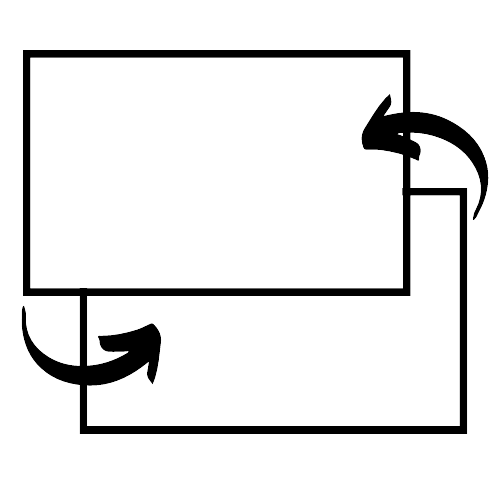

<h1 align="center">HTML-Scene-Manager</h1>

A Simple Scene Manager for HTML Websites using JavaScript

For Documentation, go to <code>Docs.md</code>. A Demo is in <code>SceneDemo.html</code>. If you want to take a look at the code, go to <code>SceneManager.js</code>

